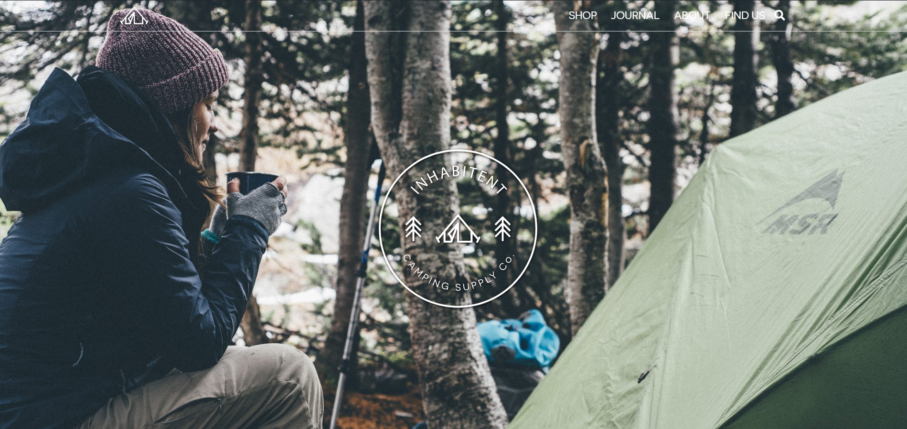
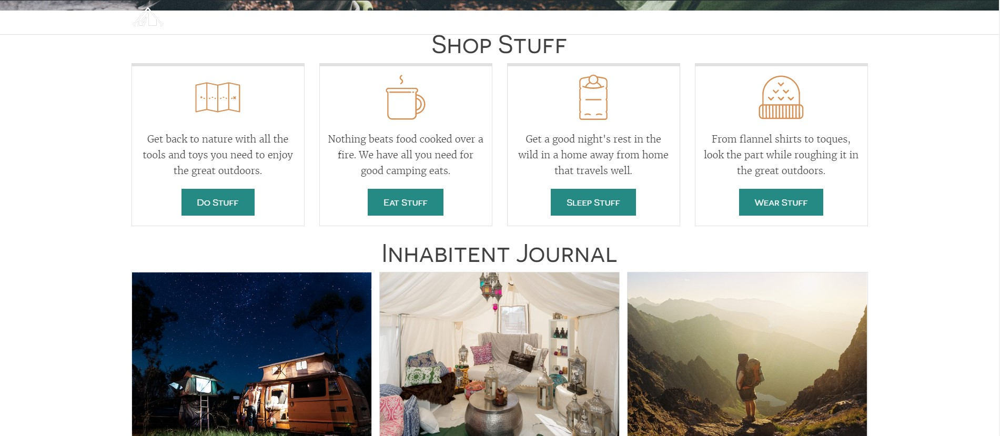
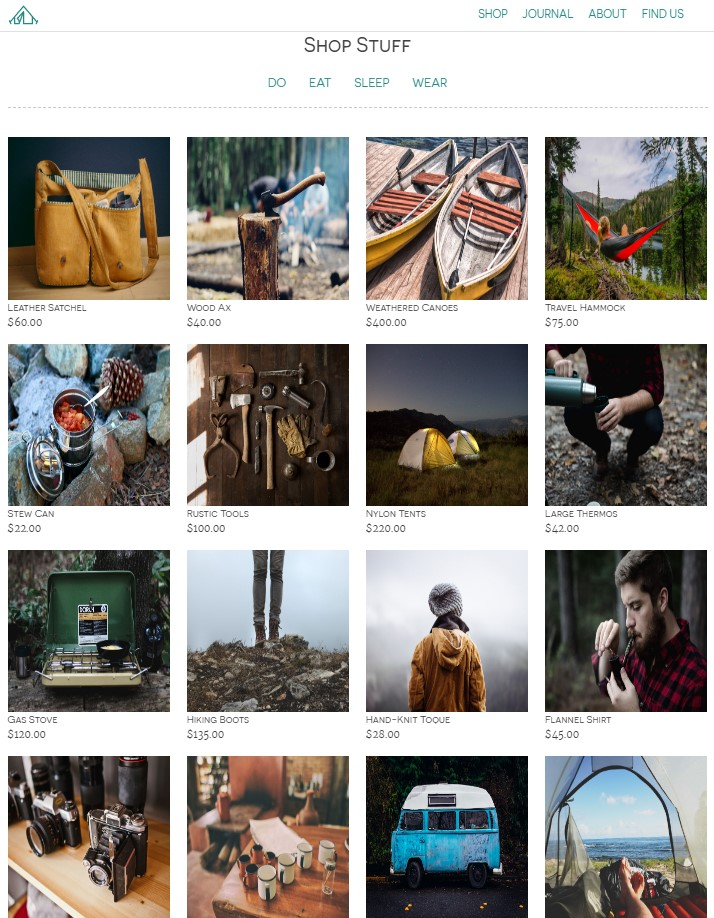
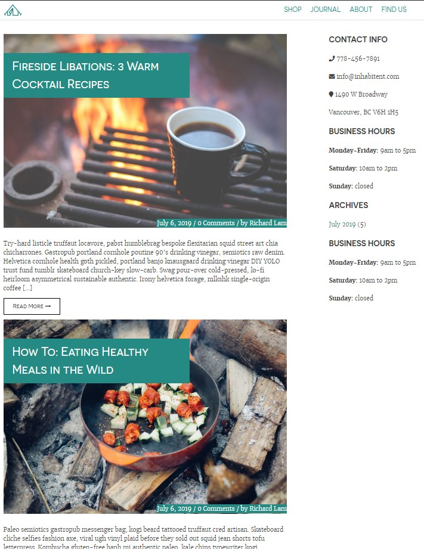
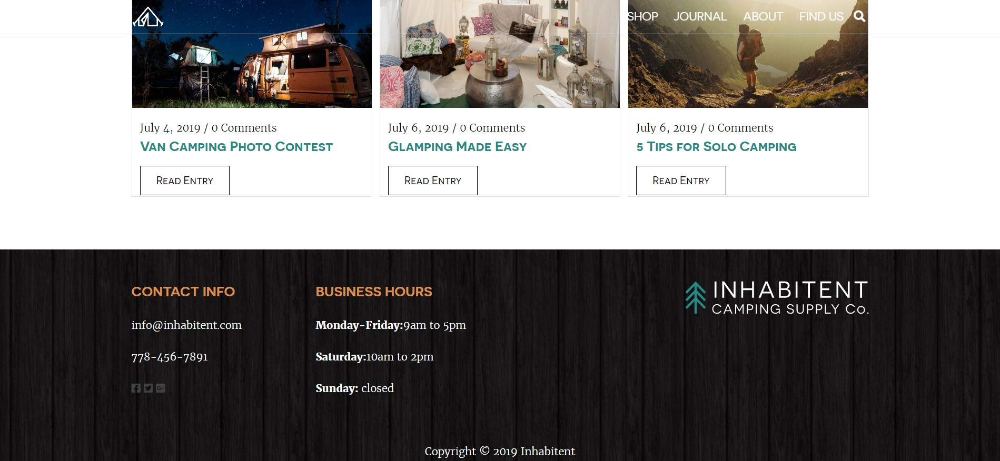

# Inhabitent Site

The Inhabitent site is a multi-page website with a blog for a camping supply company using WordPress as a content management system.

## Technologies Used

1. Wordpress 
2. Underscores starter theme
3. Gulp and it's dependencies
4. Wordpress plugin-ins : Custom Field Suite, Inhabitent Blocks, Inhabitent Business Hours Widget, Show Current Template

## WordPress/PHP

* Built with WordPress as CMS
* Custom post type for “Products”
* Custom a taxonomy for “Product Type”
* Custom Business Hours widget to easily edit business hours by the client
* Custom Field Suite plugins allows client to add price of products

## HTML

HTML5 doctype

## SASS/CSS

* Sass as a preprocessor
* Implements layout using flexbox
* Incorporate custom fonts using @font-face
* Uses Font Awesome for icon fonts

## JS/jQuery

* Incorporates a toggle-able expanding search bar to the site header

## Personal Learnings

* Use WordPress as a content management system
* Wordpress template hierarchy
* PHP and SASS, for the creation of page templates

